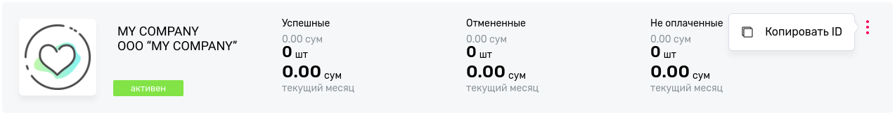
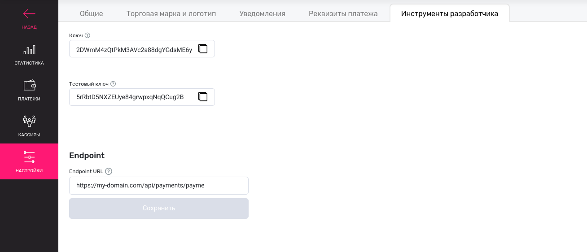
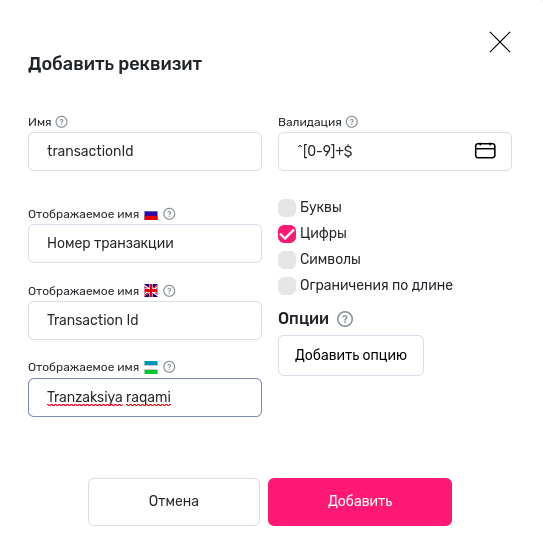

# Payme

## Installation

### Install the package<br>

```bash
composer req kadirov/payme
```

### Add it to _config/bundles.php_<br>

```php
Kadirov\PaymeBundle::class => ['all' => true],
```

### Add next lines to your _.env_ file <br>

```dotenv
### Payme
PAYME_AFTER_FINISH_PAYMENT_CLASS=Your\Class\Namespace
PAYME_BEFORE_CANCEL_FINISHED_PAYMENT_CLASS=Your\Class\Namespace
PAYME_LOGIN=""
PAYME_KEY=""
PAYME_TEST_LOGIN=Paycom
PAYME_TEST_KEY=""
PAYME_IP1=195.158.31.134
PAYME_IP2=195.158.31.10
### Payme
```

### Add payme route to _config/packages/security.yaml_ file

```yaml
security:
    firewalls:
        payme:
            pattern: ^/api/payments/payme
            security: false
            methods:
                - post
```

## How to use

Create PaymeTransaction via [PaymeTransactionFactory](src/Component/Billing/Payment/Payme/PaymeTransactionFactory.php).
When user pays this payment, system will call afterFinishPayment() method of [AfterFinishPaymentInterface](src/Component/Billing/Payment/Payme/Interfaces/AfterFinishPaymentInterface.php).
So, create class which implements AfterFinishPaymentInterface.

Also, you have to implement [BeforeCancelFinishedPaymentInterface](src/Component/Billing/Payment/Payme/Interfaces/BeforeCancelFinishedPaymentInterface.php). 
Method in this class will call before cancel a payment. If canceling payment is impossible you can throw 
[BeforeCancelFinishedPaymentException](src/Component/Billing/Payment/Payme/Exceptions/BeforeCancelFinishedPaymentException.php).

## How to connect your project with Payme

You should create company on [merchant.payme.uz](https://merchant.payme.uz/). 
Then copy ID and specify it as value of **PAYME_LOGIN**



Enter to cashbox of your project, click to settings then developer tools where you can find **key** and **test key**. Specify them as values of **PAYME_KEY** and **PAYME_TEST_KEY**

Also, you have to enter **Endpoint URL** like to https://my-domain.com/api/payments/payme



Click to tab **Payment details** and create **transactionId**



## Done!
