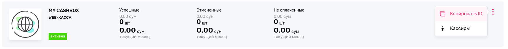

# Payme

## Installation

### Install the package

```bash
composer req kadirov/payme
```

### Add to config/bundles.php

```php
Kadirov\Payme\PaymeBundle::class => ['all' => true],
```

### Create AfterFinishPaymentInterface and BeforeCancelFinishedPayment classes. Add next to config/services.yaml

```yaml
services:
    Kadirov\Payme\Component\Billing\Payment\Payme\Interfaces\BeforeCancelFinishedPaymentInterface:
        class: App\Component\Payme\BeforeCancelFinishedPayment

    Kadirov\Payme\Component\Billing\Payment\Payme\Interfaces\AfterFinishPaymentInterface:
        class: App\Component\Payme\AfterFinishPayment
```

### Add next lines to your .env file

```dotenv
### Payme
PAYME_CASHBOX_ID=""
PAYME_CASHBOX_KEY=""
PAYME_CASHBOX_TEST_ID=Paycom
PAYME_CASHBOX_TEST_KEY=""
PAYME_CHECK_IPS=true
PAYME_IPS="185.234.113.1,185.234.113.2,185.234.113.3,185.234.113.4,185.234.113.5,185.234.113.6,185.234.113.7,185.234.113.8,185.234.113.9,185.234.113.10,185.234.113.11,185.234.113.12,185.234.113.13,185.234.113.14,185.234.113.15"
### Payme
```

### Add payme route to config/packages/security.yaml file

```yaml
security:
    firewalls:
        payme:
            pattern: ^/api/payments/payme
            security: false
            methods:
                - post
```

## How to use

Create PaymeTransaction via createTransaction() method of [PaymeTransactionBuilder](src/Payme/Component/Billing/Payment/Payme/PaymeTransactionBuilder.php).
For fiscalization you can also call addItem() method. 

### Example of simple using
```php
$paymeTransaction = $paymeTransactionBuilder
            ->createTransaction($price)
            ->getResult();
````

### Example with fiscalization
```php
$paymeTransaction = $paymeTransactionBuilder
    ->createTransaction($finalPrice)
    ->addItem('10315002001000000', 3, '195815', $consultingPrice, 'Consulting services', 15)
    ->addItem('10305005001000000', 1, '195763', $softwarePrice, 'Software Development', 15)
    ->getResult();    

````


When user pays this payment, system will call afterFinishPayment() method
of [AfterFinishPaymentInterface](src/Payme/Component/Billing/Payment/Payme/Interfaces/AfterFinishPaymentInterface.php). So,
create class which implements AfterFinishPaymentInterface.

Also, you have to
implement [BeforeCancelFinishedPaymentInterface](src/Payme/Component/Billing/Payment/Payme/Interfaces/BeforeCancelFinishedPaymentInterface.php)
. Method in this class will call before cancel a payment. If canceling payment is impossible you can throw
[BeforeCancelFinishedPaymentException](src/Payme/Component/Billing/Payment/Payme/Exceptions/BeforeCancelFinishedPaymentException.php)
.

## How to connect your project with Payme

You should create cashbox on [merchant.payme.uz](https://merchant.payme.uz/). Then copy ID and specify it as value of 
**PAYME_CASHBOX_ID**



Enter to the cashbox, click to settings then developer tools where you can find **key** and **test key**.
Specify them as values of **PAYME_CASHBOX_KEY** and **PAYME_CASHBOX_TEST_KEY**

Also, you have to enter **Endpoint URL** like to https://my-domain.com/api/payments/payme


Click to tab **Payment details** and create **transactionId**


## Add next form and users can pay by clicking the button

```html
<!-- Start Payme Form -->
<form method="POST" action="https://checkout.paycom.uz">
    <!-- Use https://test.checkout.paycom.uz URL for testing -->

    <!-- Payme Cashbox ID  -->
    <input type="hidden" name="merchant" value="{{ PAYME_CASHBOX_ID }}"/>

    <!-- Cost with tiyin -->
    <input type="hidden" name="amount" value="{{ transaction.amount }}"/>

    <!-- Payment data -->
    <input type="hidden" name="account[transactionId]" value="{{ transaction.id }}"/>

    <!-- === OPTIONAL DATA === -->
    <!-- Language. By default 'ru'. Available options: ru|uz|en -->
    <input type="hidden" name="lang" value="{{ lang }}"/>

    <!-- 
        Currency. By default '860'. Available options: 643|840|860|978
        643 - RUB
        840 - USD
        860 - UZS
        978 - EUR 
    -->
    <input type="hidden" name="currency" value="860"/>

    <!-- 
        URL to redirecting after payment. By default, payme redirects to URL of Referer header value.
        URL may contain that will be replaced by Payme: 
        :transaction - id of transaction. Can be null if payme couldn't create transaction
        :account.{field} - field of account object
        For example: https://your-service.com/payme/:transaction 
    -->
    <!--            
        <input type="hidden" name="callback" value="{{ REDIRECT_URL }}"/>
    -->

    <!-- Redirect timeout after successful payment in milliseconds  -->
    <input type="hidden" name="callback_timeout" value="15"/>

    <!-- 
        Payment description. You can also specify descriptions in few 
        languages by using description object like name="description[{lang}]".
        As {lang} you can use ru, en or uz
    -->
    <input type="hidden" name="description" value="{{ PAYME_DESCRIPTION }}"/>

    <!-- 
        Details of payment. You can use JSON object encoded by BASE64. 
        For example:
        {
            "discount": {
                 "title": "discount 5%", 
                 "price": 10000
            },
            "shipping": {
                  "title": "Shipment to Termez 28/23", 
                  "price": 500000
            },
            "items": [
                {
                    "title": "Tomato", 
                    "price": 505000, 
                    "count": 2
                }
            ]
        }
     -->

    <button type="submit" >Pay with <b>Payme</b></button>
</form>
```


